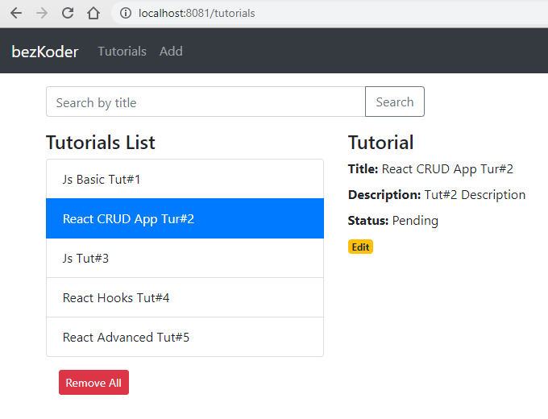

# React.js CRUD App with React Router & Axios

Проект от [React CRUD example to consume Web API](https://bezkoder.com/react-crud-web-api/). 

### Git ветки
Основная ветка __main__.
Простой пример в git ветке __demo_route__.
Ветку __master__ не удалять. Это пример старта проекта с React.

Заготовка для React проекта. React 17.

__Redux не используется.__ ([пример приложения с Redux](https://www.bezkoder.com/react-redux-crud-example/)). Для работы с backend сделан сервисный слой __services__. Что-то типа __state__ расположен в самих компонентах.

Build a React.js CRUD Application to consume Web API, display and modify data with Router, Axios & Bootstrap.

React Tutorial Application in that:
- Each Tutorial has id, title, description, published status.
- We can create, retrieve, update, delete Tutorials.
- There is a Search bar for finding Tutorials by title.



For instruction, please visit:
> [React CRUD example to consume Web API](https://bezkoder.com/react-crud-web-api/)

Related Posts:
> [React Typescript CRUD example to consume Web API](https://bezkoder.com/react-typescript-axios/)

> [React Redux CRUD App example with Rest API](https://bezkoder.com/react-redux-crud-example/)

> [React (Hooks) CRUD example to consume Web API](https://bezkoder.com/react-hooks-crud-axios-api/)

> [React Table example: CRUD App with react-table v7](https://bezkoder.com/react-table-example-hooks-crud/)

Using Material UI instead of Bootstrap:
> [React Material UI examples with a CRUD Application](https://bezkoder.com/react-material-ui-examples-crud/)

More Practice:
> [React Pagination example](https://bezkoder.com/react-pagination-material-ui/)

> [React File Upload example](https://bezkoder.com/react-file-upload-axios/)

> [React JWT Authentication & Authorization example](https://bezkoder.com/react-jwt-auth/)

> [React + Redux: JWT Authentication & Authorization example](https://bezkoder.com/react-redux-jwt-auth/)

Fullstack with Node.js Express:
> [React.js + Node.js Express + MySQL](https://bezkoder.com/react-node-express-mysql/)

> [React.js + Node.js Express + PostgreSQL](https://bezkoder.com/react-node-express-postgresql/)

> [React.js + Node.js Express + MongoDB](https://bezkoder.com/react-node-express-mongodb-mern-stack/)

Fullstack with Spring Boot:
> [React.js + Spring Boot + MySQL](https://bezkoder.com/react-spring-boot-crud/)

> [React.js + Spring Boot + PostgreSQL](https://bezkoder.com/spring-boot-react-postgresql/)

> [React.js + Spring Boot + MongoDB](https://bezkoder.com/react-spring-boot-mongodb/)

Fullstack with Django:

> [React.js + Django Rest Framework](https://bezkoder.com/django-react-axios-rest-framework/)

Serverless:
> [React Firebase CRUD App with Realtime Database](https://bezkoder.com/react-firebase-crud/)

> [React Firestore CRUD App example | Firebase Cloud Firestore](https://bezkoder.com/react-firestore-crud/)

Integration (run back-end & front-end on same server/port)
> [How to integrate React.js with Spring Boot](https://bezkoder.com/integrate-reactjs-spring-boot/)

> [Integrate React with Node.js Express on same Server/Port](https://bezkoder.com/integrate-react-express-same-server-port/)


This project was bootstrapped with [Create React App](https://github.com/facebook/create-react-app).

### Set port
.env
```
PORT=8081
```

## Project setup

In the project directory, you can run:

```
npm install
# or
yarn install
```

or

### Compiles and hot-reloads for development

```
npm start
# or
yarn start
```

Open [http://localhost:8081](http://localhost:8081) to view it in the browser.

The page will reload if you make edits.


````shell
yarn add --dev sinon
````

````shell
yarn test
````

Установка нужной версии node:

````shell
$ nvm use node 16.10.0

$ node --version
v16.10.0

Проверка
$ yarn
````

Для mock использован sinon. (см. tutorial.service.spec.js)

### Start

````shell
yarn start
````

### Test

Прогон всех тестов:

````shell
yarn test
````

Прогон файла с тестами:

````shell
yarn test vacancy.service.spec.js
````

Прогон конкретного теста:

````shell
yarn test -t individual test

 PASS  src/components/try_react_test.spec.js
  Try react-testing-library
    ✓ individual test (4 ms)
    ○ skipped array contains item

Test Suites: 1 passed, 1 total
Tests:       1 skipped, 1 passed, 2 total

````

'skipped array contains item' - тест в этом же файле (src/components/try_react_test.spec.js) и он пропущен.

Еще пример:

````shell
yarn test -t 'input with id=#description'

Test Suites: 3 skipped, 1 passed, 1 of 4 total
Tests:       12 skipped, 1 passed, 13 total
Snapshots:   0 total
Time:        4.327 s, estimated 5 s
Ran all test suites with tests matching "input with id=#description".

````
или указать название в обратных кавычках (если в названии теста есть спецсимволы):

````shell
yarn test -t `test title (render.getByText)`
````

### Build

````shell
$ yarn build
yarn run v1.22.5
$ react-scripts build
Creating an optimized production build...
Browserslist: caniuse-lite is outdated. Please run:
npx update-browserslist-db@latest
Why you should do it regularly: https://github.com/browserslist/update-db#readme
Browserslist: caniuse-lite is outdated. Please run:
npx update-browserslist-db@latest
Why you should do it regularly: https://github.com/browserslist/update-db#readme
Compiled successfully.

File sizes after gzip:

73.6 kB   build/static/js/main.0f4da891.js
23.43 kB  build/static/css/main.7b1271f9.css

The project was built assuming it is hosted at /.
You can control this with the homepage field in your package.json.

The build folder is ready to be deployed.
You may serve it with a static server:

yarn global add serve
serve -s build

Find out more about deployment here:

https://cra.link/deployment

Done in 28.39s.

````
Собранные файлы будут в папке __build__.

Запуск билда:

````shell
$ serve -s build
````

Открыть http://<адрес apache2 сервера>/vacancies/.


Локальный запуск:

````shell
~/prog/js/vacancy_frontend_17$ ./run.sh

Compiled successfully!

You can now view vacancy_frontend in the browser.

  Local:            http://localhost:8081/vacancies
  On Your Network:  http://192.168.1.57:8081/vacancies

Note that the development build is not optimized.
To create a production build, use yarn build.

webpack compiled successfully

````

### Размещенеие на сервере

Файлы из папки build скопировать в Apache /var/www/main/vacancies.

Корневой адрес приложения для frontend указан в package.json:

````shell
  "scripts": {
    ....
    "build": "PUBLIC_URL=/vacancies react-scripts build",
    ....
}
````

Адрес __backend сервиса__  указан в src/http-common.js:

````shell
export default axios.create({
  baseURL: "https://v.perm.ru:8443",
  mode: "no-cors",
  headers: {
    "Content-type": "application/json"
  }
});
````

### Разное

mapStateToProps (redux)

Переход на главную страницу после удаления позиции ("this.props.router.navigate('/vacancy')"):

````shell
deleteVacancy() {    
    VacancyService.delete(this.state.currentVacancy.n)
        .then(response => {
            console.log(response.data);
            // Переход на страницу со списком
            this.props.router.navigate('/vacancy');
        })
        .catch(e => {
        console.log(e);
    });
}

````

__[Enzyme больше не поддерживается. нужно использовать react-testing-library](https://habr.com/ru/companies/ruvds/articles/353076/).__

"react-testing-library, в которой он видит простой инструмент, способный заменить enzyme"

[A Guide To Testing React Components With Jest And React Testing Library](https://keploy.io/blog/community/a-guide-to-testing-react-components-with-jest-and-react-testing-library)

[React: тестируем компоненты с помощью Jest и Testing Library](https://habr.com/ru/companies/timeweb/articles/670480/)

https://blog.logrocket.com/testing-react-apps-jest-react-testing-library/


Основная ветка __main__.
Ветку __master__ не удалять. Это пример старта.

Примеры тестов jest в ~/prog/js/jest-testing.


### Маршрутизация с apache2

Для работы React Routing в каталоге с приложением разместить файл [.htaccess](doc/.htaccess). 

````shell
<IfModule mod_rewrite.c>
RewriteEngine on
# Don't rewrite files or directories
RewriteCond %{REQUEST_FILENAME} -f [OR]
RewriteCond %{REQUEST_FILENAME} -d
RewriteRule ^ - [L]
# Rewrite everything else to index.html to allow html5 state links
RewriteRule ^ index.html [L]
</IfModule>
````

Содержимое каталога проекта на сервере:

````shell
root@v:/var/www/main/vacancies#  ls -a
asset-manifest.json  
.htaccess  <--------- 
logo192.png  
manifest.json  
static
favicon.ico          
index.html  
logo512.png  
robots.txt
````


При тестировании появляется сообщение __"Cannot log after tests are done. Did you forget to wait for something async in your test?"__  
Для исправвления нужно добавить "--maxWorkers=2" (источник [https://habr.com/ru/articles/710342/](https://habr.com/ru/articles/710342/)).

package.json:

````shell
....
  "test": "react-scripts test --maxWorkers=2",
....  
````

Форматированный вывод объекта:

````shell
    console.log("response" + JSON.stringify(response);
````
